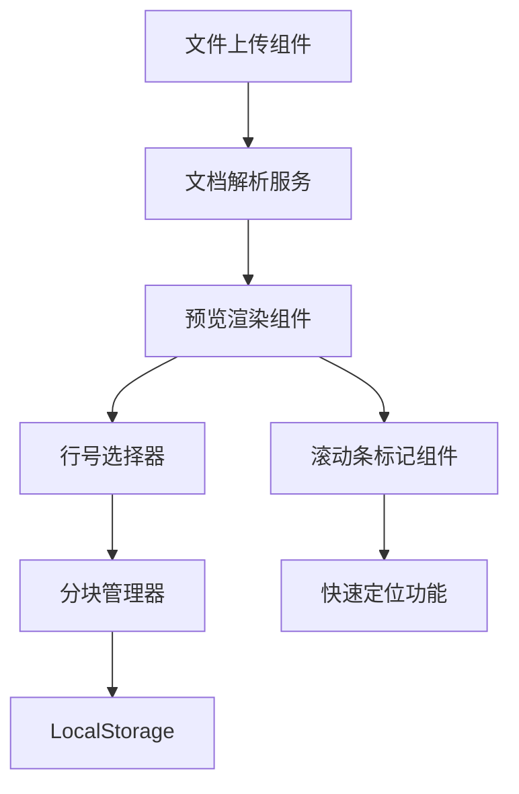

## 产品概述

一个 Word 文档预览与内容分块管理的网页应用，支持用户上传文档、预览内容、手动标记内容分块并进行管理。

## 核心功能

- **文件上传**：支持拖拽和点击上传，接受 .docx、.doc、.txt 等多种文档格式
- **文档预览**：将 Word 文档转换为可预览的 HTML 内容，显示行号标识
- **内容分块**：用户选中开始行和结束行创建分块，支持命名、编辑、删除操作
- **滚动条高亮**：在滚动条旁显示颜色块，标识每个分块的范围
- **快速定位**：点击颜色块跳转到对应分块的起始位置
- **数据持久化**：分块数据自动保存到本地存储，刷新页面后可恢复

## 技术栈选择

- **前端框架**：Vue 3 + TypeScript
- **构建工具**：Vite
- **UI 组件库**：Element Plus（提供文件上传、弹窗等组件）
- **样式方案**：Tailwind CSS
- **文档解析**：mammoth.js（解析 .docx）、docx-preview（预览增强）、纯文本处理 .txt
- **数据持久化**：LocalStorage

## 实现方案

### 文档解析策略

1. **.docx 文件**：使用 mammoth.js 将 docx 转换为 HTML，保留基本格式
2. **.doc 文件**：浏览器端难以直接解析，提示用户转换为 .docx 格式或使用后端服务转换
3. **.txt 文件**：直接读取文本内容，按行渲染

### 核心交互流程

1. 用户上传文件 → 解析文档 → 渲染预览内容（带行号）
2. 用户按住 Shift 点击行号选择范围 → 弹窗输入分块名称 → 创建分块
3. 分块数据存储到数组 → 同步保存到 localStorage
4. 监听滚动容器 → 在滚动条旁渲染颜色块标记
5. 点击颜色块 → scrollIntoView 跳转到对应行

### 性能优化

- 大文档采用虚拟滚动（仅渲染可视区域行）
- 颜色块定位使用 CSS transform 而非重绘
- 分块操作使用增量更新 localStorage

## 架构设计

### 系统架构



### 模块划分

- **FileUploader**：文件上传组件，支持拖拽和点击
- **DocParser**：文档解析服务，处理不同格式文档
- **DocPreview**：文档预览组件，渲染带行号的内容
- **BlockManager**：分块管理器，处理分块的 CRUD 操作
- **ScrollMarker**：滚动条标记组件，显示颜色块并处理定位

## 目录结构

```
project-root/
├── index.html                    # [NEW] 入口 HTML 文件
├── package.json                  # [NEW] 项目配置和依赖
├── vite.config.ts                # [NEW] Vite 构建配置
├── tailwind.config.js            # [NEW] Tailwind CSS 配置
├── tsconfig.json                 # [NEW] TypeScript 配置
├── src/
│   ├── main.ts                   # [NEW] 应用入口文件
│   ├── App.vue                   # [NEW] 根组件，布局整体页面
│   ├── style.css                 # [NEW] 全局样式
│   ├── types/
│   │   └── block.ts              # [NEW] 分块数据类型定义
│   ├── composables/
│   │   ├── useBlockManager.ts    # [NEW] 分块管理逻辑 Hook
│   │   └── useScrollMarker.ts    # [NEW] 滚动标记逻辑 Hook
│   ├── services/
│   │   └── docParser.ts          # [NEW] 文档解析服务
│   ├── components/
│   │   ├── FileUploader.vue      # [NEW] 文件上传组件
│   │   ├── DocPreview.vue        # [NEW] 文档预览组件（带行号）
│   │   ├── BlockEditor.vue       # [NEW] 分块编辑弹窗组件
│   │   └── ScrollMarker.vue      # [NEW] 滚动条颜色标记组件
│   └── utils/
│       └── storage.ts            # [NEW] LocalStorage 封装工具
```

## 关键数据结构

```typescript
// 分块数据类型
interface ContentBlock {
  id: string;
  name: string;
  startLine: number;
  endLine: number;
  color: string;  // 自动生成的颜色
  createdAt: number;
}

// 文档状态
interface DocState {
  fileName: string;
  content: string[];
  blocks: ContentBlock[];
  totalLines: number;
}
```

## 设计风格

采用现代简约风格，以清晰的内容展示和流畅的交互体验为核心。使用淡雅的配色方案，确保长时间阅读的舒适性。

## 页面规划

### 主页面（单页应用）

页面分为左右两个区域：

- **左侧区域（60%）**：文档预览区，显示上传的文档内容，每行带行号标识
- **右侧区域（40%）**：分块管理面板，显示所有分块列表，支持编辑和删除

### 功能区块设计

1. **顶部导航栏**：Logo、文件上传按钮、帮助提示
2. **文档预览区**：滚动容器、行号列、内容列、选中高亮效果
3. **滚动条标记栏**：紧贴滚动条右侧，显示各分块的颜色标记
4. **分块管理面板**：分块列表、新增按钮、编辑/删除操作
5. **底部状态栏**：当前文档信息、总行数、分块数量